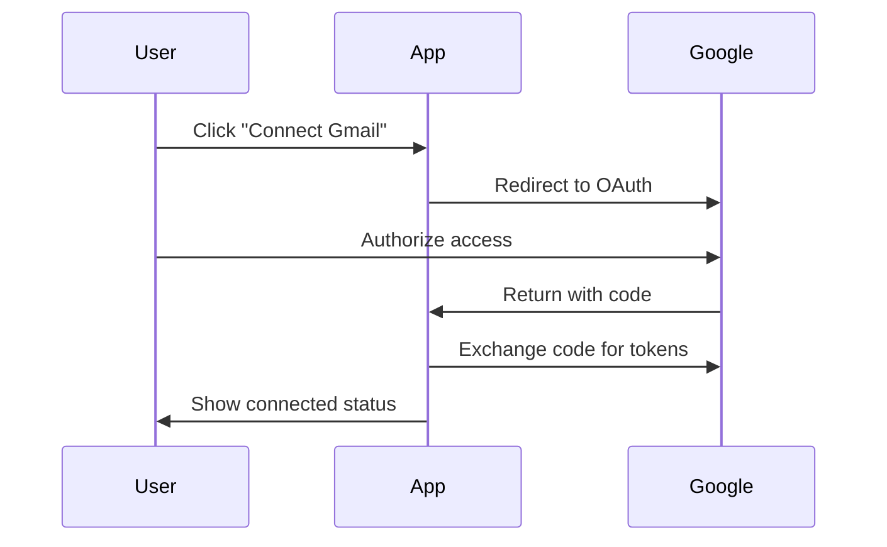
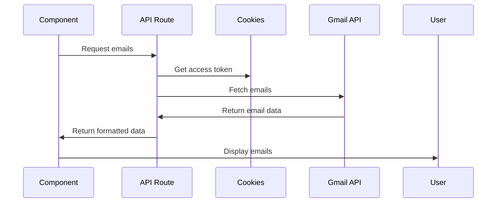

# Gmail Integration

## Overview

The application integrates directly with Gmail API to fetch and manage emails without requiring a backend server or database. All email data is retrieved in real-time from Gmail.

## Features

### Email Management

- View emails with pagination
- Filter by Gmail labels
- Search using Gmail's powerful search syntax
- Real-time data - always current

### Label Support

- Fetch all user labels
- Filter emails by label
- Support for system and custom labels

### Authentication

- Secure OAuth 2.0 flow
- Automatic token refresh
- Easy connect/disconnect

## How It Works

### 1. Authentication Flow



### 2. Data Flow



## Gmail Search Queries

The application supports all Gmail search operators:

### Basic Searches

- `is:unread` - Unread emails
- `is:important` - Important emails
- `from:example@gmail.com` - From specific sender
- `subject:invoice` - Specific subject

### Advanced Searches

- `has:attachment` - Emails with attachments
- `larger:10M` - Large emails
- `after:2024/1/1` - Date filtering
- `label:work` - By label

### Combining Searches

- `is:unread label:important` - Unread AND important
- `from:client@example.com OR from:partner@example.com` - Multiple senders

## Implementation Details

### OAuth Scopes

The application requests these Gmail scopes:

- `gmail.readonly` - Read emails and labels
- `gmail.labels` - Manage labels
- `gmail.modify` - Modify emails (future feature)
- `email` - Get user's email address
- `profile` - Get user's profile info

### Token Management

1. **Access Token**

   - Short-lived (1 hour)
   - Stored in HTTP-only cookie
   - Used for API requests

2. **Refresh Token**
   - Long-lived
   - Stored in HTTP-only cookie
   - Used to get new access tokens

### API Endpoints

#### Authentication

- `GET /api/auth/gmail/auth-url` - Start OAuth flow
- `POST /api/auth/gmail/callback` - Complete OAuth
- `GET /api/auth/gmail/status` - Check connection
- `DELETE /api/auth/gmail/disconnect` - Logout

#### Data Access

- `GET /api/gmail/emails` - Fetch emails
- `GET /api/gmail/labels` - Fetch labels

## Usage Examples

### Connect Gmail

```typescript
const connectGmail = async () => {
  // Get auth URL
  const response = await fetch("/api/auth/gmail/auth-url");
  const { authUrl } = await response.json();

  // Open in popup
  const popup = window.open(authUrl, "gmail-auth", "width=500,height=600");

  // Listen for completion
  window.addEventListener("message", (event) => {
    if (event.data.type === "gmail-auth-success") {
      popup?.close();
      // Refresh UI
    }
  });
};
```

### Fetch Emails

```typescript
const fetchEmails = async (query = "is:unread") => {
  const response = await fetch(
    `/api/gmail/emails?q=${encodeURIComponent(query)}`
  );
  const { emails } = await response.json();
  return emails;
};
```

### Filter by Label

```typescript
const fetchByLabel = async (labelName: string) => {
  const emails = await fetchEmails(`label:${labelName}`);
  return emails;
};
```

## Best Practices

### 1. Error Handling

Always handle authentication errors:

```typescript
try {
  const response = await fetch("/api/gmail/emails");
  if (response.status === 401) {
    // Token expired, reconnect Gmail
  }
  const data = await response.json();
} catch (error) {
  console.error("Failed to fetch emails:", error);
}
```

### 2. Rate Limiting

Be mindful of Gmail API quotas:

- Cache results when possible
- Implement pagination
- Avoid excessive polling

### 3. Search Optimization

- Use specific queries to reduce results
- Leverage Gmail's search operators
- Implement client-side filtering for better UX

## Limitations

1. **API Quotas**

   - 250 quota units per user per second
   - Each operation has different costs

2. **No Offline Access**

   - Requires internet connection
   - No local data caching

3. **Gmail Features Only**
   - Limited to Gmail's capabilities
   - No custom metadata storage

## Future Enhancements

### Planned Features

1. Email composition and sending
2. Attachment handling
3. Thread view
4. Bulk operations
5. Email templates

### Possible Improvements

1. Implement caching layer
2. Add webhook support
3. Support other email providers
4. Offline mode with sync

## Troubleshooting

### Common Issues

1. **"Not authenticated with Gmail"**

   - Click "Connect Gmail" to authenticate
   - Check if tokens expired

2. **"Failed to fetch emails"**

   - Verify internet connection
   - Check browser console for errors
   - Ensure Gmail API is enabled

3. **Rate limit errors**
   - Reduce request frequency
   - Implement caching
   - Use more specific queries
