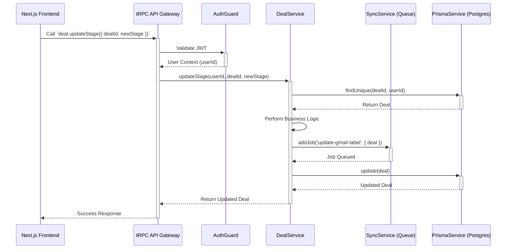

### **Section 5: Component Architecture**

The NestJS microservice will be built using a modular architecture with a clear separation of concerns.

#### Core NestJS Modules

- **AuthModule**: Manages Gmail OAuth2 flow, JWT validation, and secure token encryption.
- **TRPCModule**: Exposes the tRPC router as the primary API layer for the frontend.
- **SyncModule**: Manages all asynchronous Gmail sync jobs using BullMQ and Redis.
- **GmailModule**: A dedicated client for all Gmail API interactions, including quota management.
- **AIModule**: Manages all OpenAI API interactions, including summarization, caching, and cost tracking.
- **PrismaModule**: Provides a shared, injectable Prisma Client for database access.
- **ConfigModule**: Centralizes management of environment variables and secrets.
- **ErrorModule**: Provides centralized error handling, logging, and monitoring.
- **HealthModule**: Exposes health check endpoints for the service and its dependencies.

#### Component Interaction Diagram

